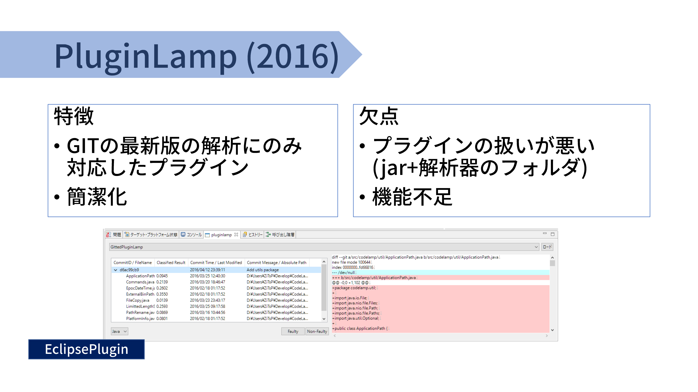
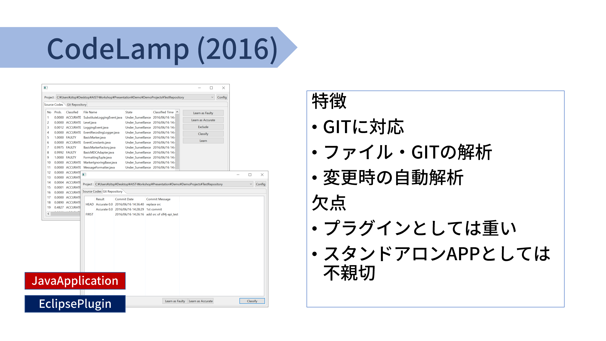

# Bugbias

BugbiasSWT(JavaSWTアプリケーション版)、BugbiasPlugin(Eclipse Plugin版)
いずれもソースコードの一部を省略して、一時的に掲載中です。

## 製作履歴 (降順)

### Bugbias(Eclipse Plugin) 2017 Jan. ~ Feb.

")

### Bugbias(SWT) 2017 Jan.

Plugin製作時の進捗デバッグ用、デモ版。

SWT版のイメージはGit時は以下のような感じで、
Git(Svn)の更新／一定時間ごと／任意のタイミングで解析します。

### PluginLamp(Eclipse Plugin) 2016 Mar. ~ Apr.

CodeLampを

### CodeLamp(Eclipse Plugin / SWT) 2015 Oct. ~ 2016 Jan.

